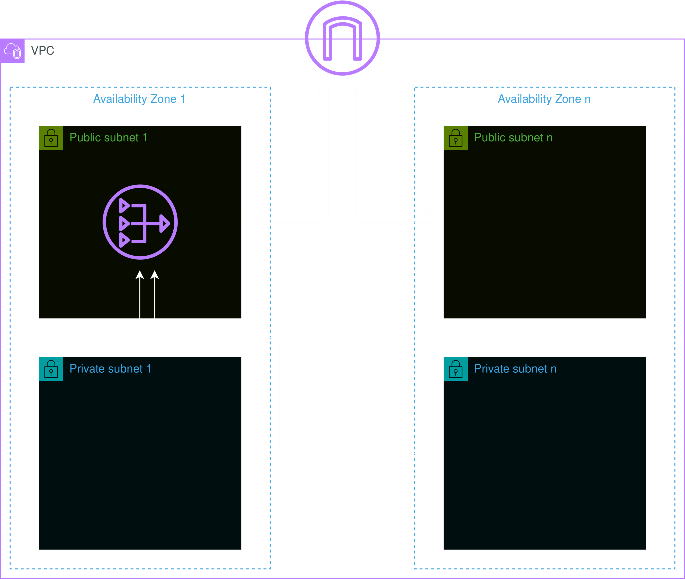

# Module: Network



This module provides a VPC with variable public and private subnets in it. The traffic of the public subnets is directly routed through the Internet Gateway and the resources in it are therefore exposed to the public internet. The traffic of the private subnets will be routed through a NAT Gateway, which will live in the first public subnet.

## Inputs

| Name            | Description                                                                                                                          | Type           | Default       | Required |
| --------------- | ------------------------------------------------------------------------------------------------------------------------------------ | -------------- | ------------- | :------: |
| name            | Name of this module, which is used as identifier on all resources.                                                                   | `string`       | ""            |    no    |
| cidr            | The IPv4 CIDR block of the VPC.                                                                                                      | `string`       | "10.0.0.0/16" |    no    |
| azs             | A list of availability zone names in the region.                                                                                     | `list(string)` | []            |    no    |
| public_subnets  | A list of CIDR blocks for the public subnets inside the VPC.                                                                         | `list(string)` | []            |    no    |
| private_subnets | A list of CIDR blocks for the private subnets inside the VPC.                                                                        | `list(string)` | []            |    no    |
| nat_gw          | A flag for wether or not creating a NAT Gateway in the first public subnet in order to route the private subnets traffic through it. | `bool`         | false         |    no    |
| tags            | A map of tags to add to all resources. Name is always set as tag and the other tags will be appended.                                | `map(string)`  | {}            |    no    |

## Outputs

| Name            | Description                         |
| --------------- | ----------------------------------- |
| id              | The ID of the VPC.                  |
| public_subnets  | List of IDs of the public subnets.  |
| private_subnets | List of IDs of the private subnets. |
| internet_gw     | The ID of the Internet Gateway.     |
| nat_gw          | The ID of the NAT Gateway.          |

## Example

```hcl
module "network" {
  source = "custom-terraform-aws-modules/network"

  name            = "example-network"
  cidr            = "10.0.0.0/16"
  azs             = ["eu-central-1a", "eu-central-1b", "eu-central-1c"]
  public_subnets  = ["10.0.1.0/24", "10.0.2.0/24", "10.0.3.0/24"]
  private_subnets = ["10.0.4.0/24", "10.0.5.0/24", "10.0.6.0/24"]
  nat_gw          = true

  tags = {
    Project     = "example-project"
    Environment = "prod"
  }
}
```
