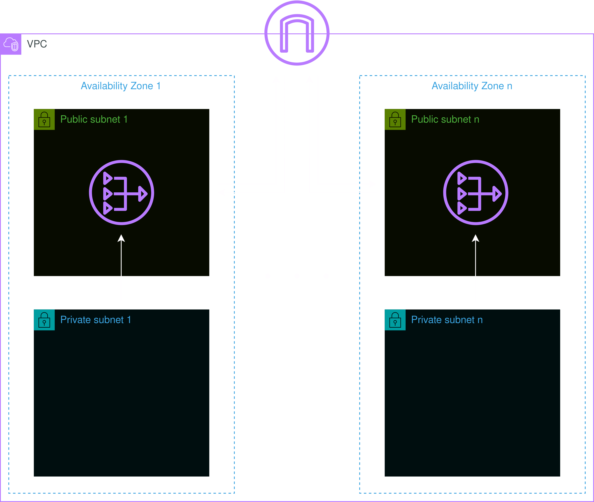

# Module: Network



This module provides a VPC with variable public and private subnets in it. The traffic of the public subnets is directly routed through the Internet Gateway and the resources in it are therefore exposed to the public internet. The traffic of the private subnets can be routed through a NAT Gateways.

## Contents

- [Requirements](#requirements)
- [Inputs](#inputs)
- [Outputs](#outputs)
- [Example](#example)
- [Contributing](#contributing)

## Requirements

| Name      | Version |
| --------- | ------- |
| terraform | >= 1.0  |
| aws       | >= 5.20 |

## Inputs

| Name            | Description                                                                                                                                                                                                            | Type           | Default       | Required |
| --------------- | ---------------------------------------------------------------------------------------------------------------------------------------------------------------------------------------------------------------------- | -------------- | ------------- | :------: |
| identifier      | Unique identifier to differentiate global resources.                                                                                                                                                                   | `string`       | n/a           |   yes    |
| cidr            | The IPv4 CIDR block of the VPC.                                                                                                                                                                                        | `string`       | "10.0.0.0/16" |    no    |
| azs             | A list of availability zone names in the region.                                                                                                                                                                       | `list(string)` | []            |    no    |
| public_subnets  | A list of CIDR blocks for the public subnets inside the VPC.                                                                                                                                                           | `list(string)` | []            |    no    |
| private_subnets | A list of CIDR blocks for the private subnets inside the VPC.                                                                                                                                                          | `list(string)` | []            |    no    |
| nat_gws         | Number of NAT Gateways to create. NOTE: for every NAT Gateway a public subnet must exist, also it is recommended to not create more NAT Gateways than private subnets as the excessive NAT Gateways would have no use. | `number`       | 0             |    no    |
| log_config      | An object for the definition for a flow log of the VPC.                                                                                                                                                                | `object`       | null          |    no    |
| tags            | A map of tags to add to all resources.                                                                                                                                                                                 | `map(string)`  | {}            |    no    |

### `log_config`

| Name              | Description                                                                                                                | Type     | Default | Required |
| ----------------- | -------------------------------------------------------------------------------------------------------------------------- | -------- | ------- | :------: |
| traffic_type      | The type of traffic to capture. Valid values: ACCEPT,REJECT, ALL.                                                          | `string` | n/a     |   yes    |
| retention_in_days | Specifies the number of days the log events shall be retained. Valid values: 1, 3, 5, 7, 14, 30, 365 and 0 (never expire). | `number` | n/a     |   yes    |

## Outputs

| Name            | Description                                                         |
| --------------- | ------------------------------------------------------------------- |
| id              | The ID of the VPC.                                                  |
| public_subnets  | List of IDs of the public subnets.                                  |
| private_subnets | List of IDs of the private subnets.                                 |
| internet_gw     | The ID of the Internet Gateway.                                     |
| nat_gws         | List of IDs of the NAT Gateways.                                    |
| log_group_name  | The name of the CloudWatch log group created for the VPC flow logs. |
| log_group_arn   | The ARN of the CloudWatch log group created for the VPC flow logs.  |

## Example

```hcl
module "network" {
  source = "github.com/custom-terraform-aws-modules/network"

  identifier      = "example-network-dev"
  cidr            = "10.0.0.0/16"
  azs             = ["eu-central-1a", "eu-central-1b", "eu-central-1c"]
  public_subnets  = ["10.0.1.0/24", "10.0.2.0/24", "10.0.3.0/24"]
  private_subnets = ["10.0.4.0/24", "10.0.5.0/24", "10.0.6.0/24"]
  nat_gws         = 3

  log_config = {
    traffic_type      = "ALL"
    retention_in_days = 7
  }

  tags = {
    Project     = "example-project"
    Environment = "dev"
  }
}
```

## Contributing

In order for a seamless CI workflow copy the `pre-commit` git hook from `.github/hooks` into your local `.git/hooks`. The hook formats the terraform code automatically before each commit.

```bash
cp ./.github/hooks/pre-commit ./.git/hooks/pre-commit
```
